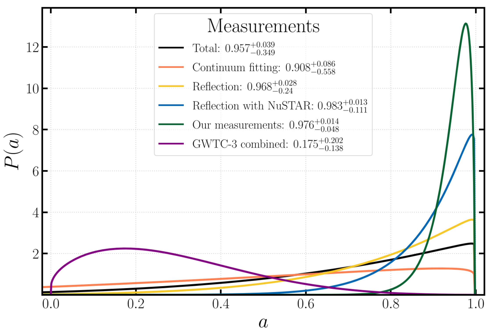

# Research

<!-- You can keep using HTML here for fine‐grained control -->

<!-- MathJax for LaTeX rendering -->

  <!-- Block 1 -->
  

    

      <h2>A Systematic View of Ten New Black Hole Spins</h2>
      

        The launch of NuSTAR and the increasing number of binary black hole (BBH) mergers detected through gravitational wave
        observations have exponentially advanced our understanding of BHs. Despite the simplicity owed to being fully
        described by their mass and angular momentum, BHs have remained mysterious laboratories that probe the most
        extreme environments in the universe.… In this work, we provide a systematic analysis of all known BHs in X-ray
        binary systems (XBs) that have previously been observed by NuSTAR, but have not yet had a spin measurement…
      

      
Here is the link to the full paper: <a href="https://ui.adsabs.harvard.edu/abs/2023ApJ...946...19D/abstract">2023ApJ...946...19D</a>

      

        Here is a block of text that includes some LaTeX formulas, such as inline \( E = mc^2 \), and block LaTeX equations:
      

    

    

      
    

  

  <!-- Block 2 -->
  

    

      <h2>Block 2 Title</h2>
      
Another text block with LaTeX content, like the famous quadratic equation:

      

        \[
        x = \frac{-b \pm \sqrt{b^2 - 4ac}}{2a}
        \]
      

    

    

      
    

  

  <!-- Add more blocks as needed -->

